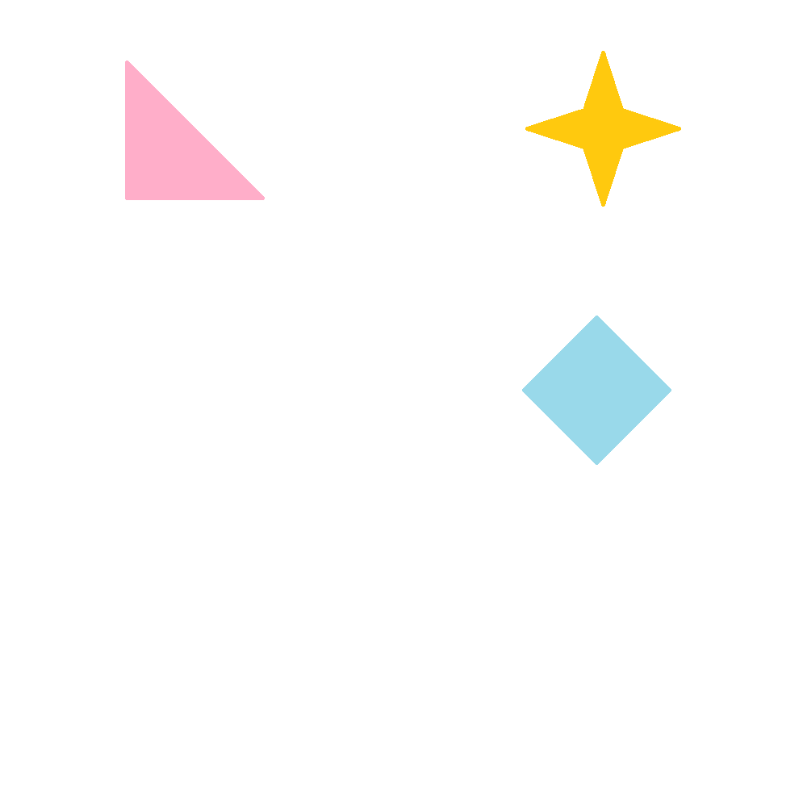

# Stars and Shapes

## Challenge

This might be a difficult question, but I'm sure you can do it with your eyes closed.
  

## Solution

The gif seems to be flashing a lot of shapes and colors. The metadata of the gif doesn't show anything, so let's try something else.
Splitting the gif with [this website]() gives you frames with shapes in 6 distinct positions. Suddenly, the description makes sense, the encryption is [braille](http://www.brailleauthority.org/learn/braillebasic.pdf)!

Each frame is a letter. Numbers are represented with 2 frames each, as that is how braille works.

⠙⠎⠉{⠙⠼⠚⠤⠽⠼⠚⠥⠤⠞⠓⠼⠁⠝⠅⠤⠓⠼⠉⠤⠎⠼⠙⠺⠤⠥⠎⠼⠛⠼⠁⠼⠉⠼⠃}

| Frame | Character |
| :---: | :-------: |
|   1   |     d     |
|   2   |     s     |
|   3   |     c     |
|   4   |     {     |
|   5   |     d     |
|   6   |     #     |
|   7   |     0     |
|   8   |     -     |
|   9   |     y     |
|  10   |     #     |
|  11   |     0     |
|  12   |     u     |
|  13   |     -     |
|  14   |     t     |
|  15   |     h     |
|  16   |     #     |
|  17   |     1     |
|  18   |     n     |
|  19   |     k     |
|  20   |     -     |
|  21   |     h     |
|  22   |     #     |
|  23   |     3     |
|  24   |     -     |
|  25   |     s     |
|  26   |     #     |
|  27   |     4     |
|  28   |     w     |
|  29   |     -     |
|  30   |     u     |
|  31   |     s     |
|  32   |     #     |
|  33   |     7     |
|  34   |     #     |
|  35   |     1     |
|  36   |     #     |
|  37   |     3     |
|  38   |     #     |
|  39   |     2     |
|  40   |     }     |

Removing the hashes, you obtain the flag

### flag = dsc{d0-y0u-th1nk-h3-s4w-us7132}
