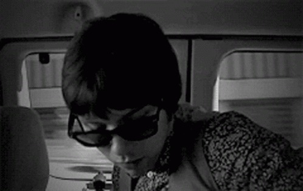

# The missing Journalist

# Challenge

It's been a year since you've been a private investigator and you've made quite a name for yourself. You sit there thinking about all the weird cases you've managed in the last year when suddenly, a person bursts through your door saying something about her missing husband. You finally gather that her husband, a renowned journalist who was tracking down a serial killer has suddenly gone missing since last night. The hysterical wife has provided you with a picture of how he looks like. Do you take the case?

<br><br>

# Solution

Examining the exif data of the gif, we find `aDNfdzQ1X2w0NXRfczMzbl80dF90aDRfbTB2MTM1` under licence, which looks a bit like a base64 encoded string.

Decoding it, we get `h3_w45_l45t_s33n_4t_th4_m0v135`

This doesn't seem to be the flag. Exploring a bit more, we find that that there's an embedded pdf in the gif! We can extract it using the command

```bash
binwalk -e the_journalist.gif
```

This gives us a locked pdf, [message.pdf](message.pdf). Putting our initial string in as the password unlocks it to give you the flag.

### flag: dsc{1_f0und_h1m_4nd_h35_my_fr13nd}
